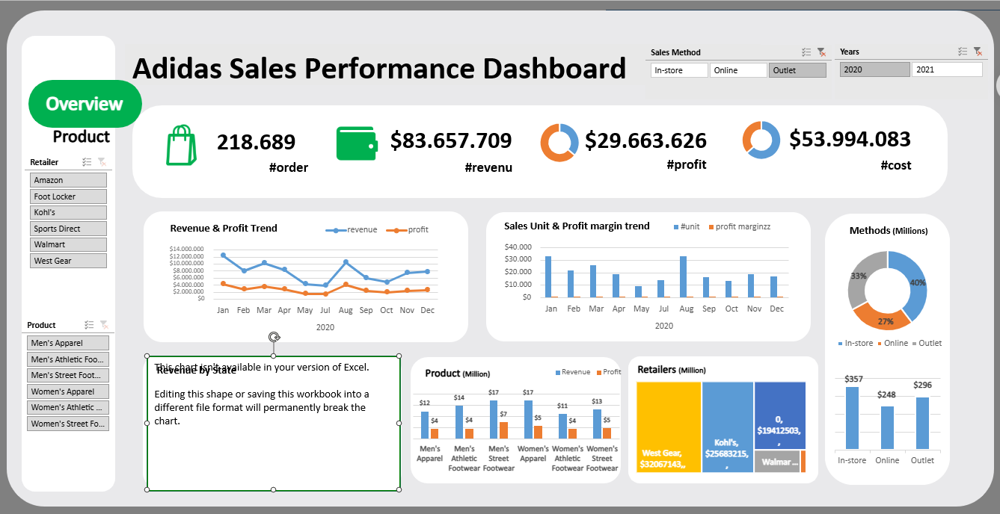
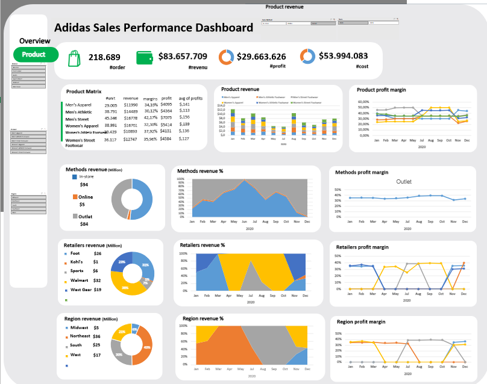

# Adidas Sales Performance Dashboard

## Mục tiêu project

Dashboard được xây dựng nhằm phân tích hiệu quả kinh doanh của Adidas trên thị trường Mỹ, dựa trên dữ liệu giao dịch bán hàng theo nhà bán lẻ, khu vực và dòng sản phẩm. Mục tiêu là trả lời ba câu hỏi kinh doanh cốt lõi: doanh thu và lợi nhuận đến từ đâu, kênh bán hàng nào đang hoạt động hiệu quả nhất, và dòng sản phẩm nào mang lại biên lợi nhuận cao nhất.

Toàn bộ dashboard được xây dựng trên Excel bằng PivotTable, PivotChart và Slicer — không dùng công cụ BI chuyên dụng — nhằm rèn kỹ năng xử lý và trực quan hóa dữ liệu bằng công cụ phổ biến trong môi trường doanh nghiệp.

## Ảnh chụp dashboard

## Dữ liệu

Bộ dữ liệu gồm **9.648 giao dịch bán hàng**, với các trường chính:

| Trường | Nội dung |
|---|---|
| `Retailer` | Nhà bán lẻ (Foot Locker, West Gear, Sports Direct, Kohl's, Amazon, Walmart) |
| `Region` / `State` / `City` | Khu vực địa lý (5 vùng: Northeast, Midwest, South, Southeast, West) |
| `Product` | Dòng sản phẩm (giày/ áo nam-nữ, theo phân khúc Athletic / Street footwear / Apparel) |
| `Price per Unit`, `Units Sold` | Giá bán và số lượng bán ra |
| `Total Sales`, `Operating Profit`, `Operating Margin` | Doanh thu, lợi nhuận, biên lợi nhuận |
| `Sales Method` | Kênh bán hàng: In-store / Outlet / Online |

## Quy trình thực hiện

### 1. Chuẩn hóa dữ liệu nguồn
Dữ liệu giao dịch thô được tổ chức lại thành một bảng dữ liệu nền (`Data Sales Adidas`) làm nguồn cho toàn bộ PivotTable. Các trường tính toán (biên lợi nhuận theo dòng sản phẩm, tỷ trọng theo kênh bán hàng) được xây dựng trực tiếp trên PivotTable thay vì tính thủ công, để đảm bảo số liệu luôn cập nhật khi lọc dữ liệu qua Slicer.

### 2. Thiết kế dashboard tổng quan (Overview Dashboard)
Trang tổng quan tổng hợp các chỉ số cấp cao: tổng doanh thu, tổng lợi nhuận, biên lợi nhuận trung bình, và xu hướng theo thời gian, kèm Slicer cho phép lọc nhanh theo năm, nhà bán lẻ, hoặc khu vực.

### 3. Thiết kế dashboard theo sản phẩm (Product Dashboard)
Trang này đi sâu vào hiệu suất từng dòng sản phẩm: doanh thu, số lượng bán ra, biên lợi nhuận theo từng danh mục, và so sánh giữa các kênh bán hàng (in-store / online / outlet).

## Kết quả phân tích chính

Trên toàn bộ tập dữ liệu (9.648 giao dịch):

- **Tổng doanh thu:** 899,9 triệu USD
- **Tổng lợi nhuận:** 332,1 triệu USD
- **Biên lợi nhuận trung bình:** 36,9%

**Theo kênh bán hàng:** In-store chiếm tỷ trọng doanh thu lớn nhất (356,6 triệu USD), theo sau là Outlet (295,6 triệu USD) và Online (247,7 triệu USD) — cho thấy kênh bán hàng truyền thống vẫn đóng vai trò chủ đạo trong tổng doanh thu.

**Theo nhà bán lẻ:** West Gear dẫn đầu về doanh thu (242,9 triệu USD), tiếp theo là Foot Locker (220,1 triệu USD) và Sports Direct (182,5 triệu USD). Ba nhà bán lẻ còn lại (Kohl's, Amazon, Walmart) đóng góp tỷ trọng thấp hơn đáng kể.

**Theo khu vực:** Khu vực West mang lại doanh thu cao nhất (269,9 triệu USD), vượt trội so với Northeast (186,3 triệu USD) và các khu vực còn lại — cho thấy mức độ tập trung doanh thu theo vùng địa lý khá rõ rệt.

**Theo dòng sản phẩm:** Men's Street Footwear có biên lợi nhuận cao nhất (39,7%), cao hơn đáng kể so với các dòng còn lại (dao động 33,7%–38,3%), trong khi Women's Apparel là dòng sản phẩm đóng góp doanh thu lớn nhất trong nhóm apparel. Đây là cơ sở để đề xuất ưu tiên nguồn lực marketing và tồn kho cho nhóm sản phẩm có biên lợi nhuận cao.

## Hạn chế và hướng phát triển tiếp theo

- Dashboard hiện dừng ở mức mô tả (descriptive analytics) — theo dõi hiệu suất quá khứ, chưa có thành phần dự báo (forecasting) doanh thu hoặc lợi nhuận cho các kỳ tiếp theo
- Phân tích khu vực và nhà bán lẻ mới dừng ở cấp độ tổng, chưa phân rã theo từng dòng sản phẩm cụ thể trong từng khu vực — đây là hướng mở rộng khả thi để xác định chính xác sản phẩm nào nên đẩy mạnh ở khu vực nào
- Do giới hạn của Excel, dashboard chỉ hỗ trợ Slicer lọc cơ bản, chưa có tương tác dạng drill-down nhiều tầng như các công cụ BI chuyên dụng (Power BI, Tableau)

## Công cụ sử dụng
Microsoft Excel · PivotTable · PivotChart · Slicer
